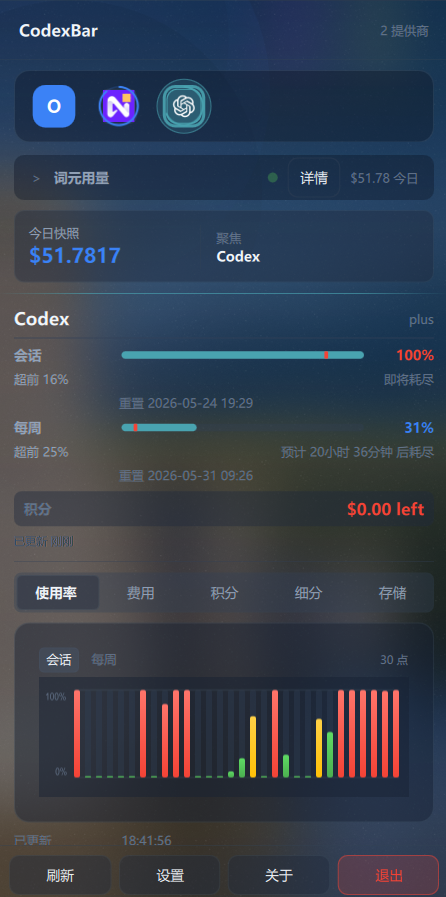
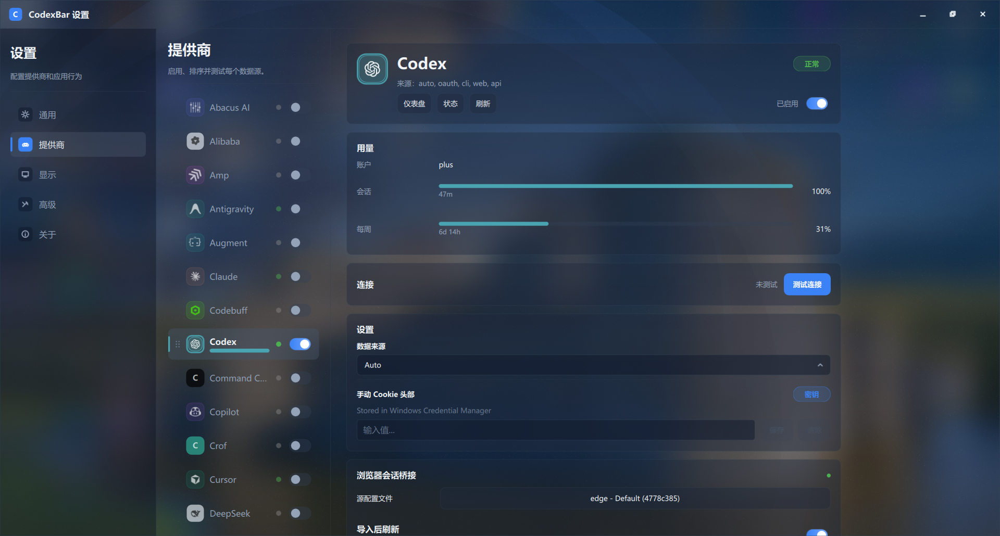

# CodexBarX

[English](README_EN.md) | 简体中文

**CodexBarX** 是一款 Windows 系统托盘工具，用于实时监控多个 AI 编程助手的用量、额度和重置时间。基于 C++ 和 Qt 6.5 开发，轻量高效，适合开发者长期常驻桌面使用。


---





---

## 功能特性

### 核心功能

- **实时用量监控** — 在系统托盘中显示今日、30 天、会话和每周的用量统计
- **30+ 服务商支持** — 覆盖所有主流 AI 编程助手，详见下方列表
- **额度追踪** — 显示剩余额度、进度条、预计耗尽时间
- **重置提醒** — 显示额度重置倒计时
- **连接状态** — 实时显示各服务商连接状态
- **开机自启** — 支持开机自动启动
- **中英双语** — 完整的国际化支持

### 视觉与交互

- **三种主题** — Dark / Midnight Blue / Amethyst 三套深色主题
- **亚克力玻璃效果** — 原生 Windows DWM 模糊 + 可调透明度（5%–95%）
- **环境光动画** — 品牌色流光渐变背景，支持三档画质（高 / 均衡 / 低）
- **无障碍支持** — Reduce Motion 模式，保留必要反馈的同时最小化装饰动画
- **指令面板** — Ctrl+P 唤出，快速搜索服务商和操作命令
- **弹性微交互** — 悬停缩放、点击回弹、展开折叠等丝滑过渡

### 数据与图表

- **费用历史图表** — 每日费用柱状图，含峰值标记和模型级费用分解
- **额度历史图表** — 每日额度消耗柱状图
- **用量分解图表** — 按服务分类（CLI / GitHub Review / API / Codex / Storage 等）的堆叠柱状图
- **计划利用率图表** — 时间维度的计划使用率曲线
- **存储空间分析** — 逐路径字节占用分解，附带清理建议

### 多账号管理

- **Codex 多账号** — OAuth 设备流认证、账号切换、升降级、重新认证
- **Token 多账号** — API Key 管理与快速切换
- **账号对账** — 本地与远端账号状态自动同步

### 浏览器会话桥接

通过 Chrome 扩展 + WebSocket 本地服务，绕过 Chrome 127+ 加密 Cookie 数据库限制，直接从浏览器导入登录凭据：

- 支持 Chrome / Edge / Brave / Opera / Vivaldi
- 三种导入模式：Cookie / localStorage / Hybrid
- 按 Provider 自动匹配域名和 Cookie 名称
- 浏览器 Profile 绑定与自动同步
- 安全设计：Bearer Token 自动脱敏，扩展权限最小化

### 托盘定制

- **四种托盘显示模式** — 仅图标 / 百分比 / 剩余时间 / 自定义时间
- **合并图标** — 所有已启用 Provider 合并为单个托盘图标
- **用量条方向** — 可切换显示已用百分比或剩余百分比
- **阈值警告** — 可配置 Warning（5%–95%）和 Critical（1%–50%）阈值滑块
- **绝对重置时间** — 可切换显示精确重置时刻或相对措辞
- **会话配额通知** — Provider 会话配额受限时发出提醒

### 诊断与调试

- **Provider 状态检查** — 轮询 statuspage 端点监控服务健康
- **调试面板** — 一键刷新、清缓存、重置设置、连接测试
- **详细日志** — Codex 抓取过程策略级诊断
- **Web 调试导出** — 保存原始 HTML 用于离线排查

---

## 支持的 AI 服务商

### 主流服务商

| 服务商 | 认证方式 | 功能支持 |
|--------|---------|---------|
| **OpenAI Codex** | OAuth / CLI | ✅ 额度、用量、重置时间、多账号 |
| **Claude** | API Key | ✅ 用量统计、峰值定价指示 |
| **GitHub Copilot** | OAuth | ✅ 订阅状态 |
| **Cursor** | Cookie | ✅ 额度、用量 |
| **Kimi** | Cookie / Token | ✅ 用量统计 |
| **DeepSeek** | API Key | ✅ 用量统计 |

### API 平台

| 平台 | 认证方式 | 功能支持 |
|------|---------|---------|
| **OpenRouter** | API Key | ✅ 用量、余额、Key 配额 |
| **z.ai** | Cookie | ✅ 额度、用量 |
| **Perplexity** | API Key | ✅ 用量统计 |
| **Mistral** | API Key | ✅ 用量统计 |

### 其他服务商

| 服务商 | 认证方式 | 服务商 | 认证方式 |
|--------|---------|--------|---------|
| Google Gemini | API Key | Google VertexAI | Service Account |
| MiniMax | API Key | Alibaba (通义千问) | API Key |
| Ollama | 本地服务 | OpenCode | 本地 SQLite |
| Augment | Cookie | Amp | Cookie |
| JetBrains AI | Cookie | Factory | API Key |
| Warp | Cookie | Abacus | Cookie |
| Codebuff | Cookie | Windsurf | SQLite |
| KimiK2 | Cookie | Kilo | Cookie |
| Kiro | Cookie | Antigravity | Cookie |
| QianFan (千帆) | API Key | Venice | API Key |
| Manus | Cookie | Doubao (豆包) | Cookie |
| StepFun (阶跃星辰) | API Key | Mimo | Cookie |
| XFXinChen (新风辰) | Cookie | OpenAI API | API Key |
| Crof | Cookie | CommandCode | Cookie |
| Synthetic | API Key | OpenCodeGo | 本地 SQLite |

---

## 系统要求

### 运行环境

- **操作系统**: Windows 10 1809 或更新版本
- **运行时**: 无需额外依赖（所有依赖已打包）

### 开发环境（仅构建需要）

- **编译器**: Visual Studio 2022 或 Build Tools
- **Qt**: 6.5.3 或更新版本 (MSVC 2022 64-bit)
- **CMake**: 3.21 或更新版本
- **Git**: 用于克隆仓库

---

## 安装方法

### 方式一：下载安装包（推荐）

1. 前往 [Releases](https://github.com/basil520/CodexBarX/releases) 页面
2. 下载最新版本的 `CodexBarX-x.x.x-Installer.exe`
3. 运行安装程序，按提示完成安装
4. 安装完成后自动创建桌面快捷方式和开始菜单项

### 方式二：便携版

1. 下载 `CodexBarX-x.x.x-portable.zip`
2. 解压到任意目录
3. 双击 `CodexBarX.exe` 运行
4. 可创建桌面快捷方式方便使用

---

## 使用方法

### 首次运行

1. 启动 CodexBarX，程序将最小化到系统托盘
2. 右键点击托盘图标，选择 **Settings**（设置）
3. 在 **Providers**（服务商）标签页中启用需要的服务商
4. 根据提示配置认证信息（API Key 或自动登录）

### 配置服务商

#### API Key 方式

1. 在设置中选择对应服务商
2. 点击 **Configure**（配置）
3. 输入 API Key
4. 点击 **Test**（测试）验证连接

#### 自动登录方式

部分服务商支持自动读取浏览器 Cookie 或 CLI 配置：

- **OpenAI Codex**: 自动读取 Codex CLI 配置或浏览器登录状态
- **Cursor**: 自动读取 Chrome/Edge Cookie
- **Kimi**: 自动读取 Chrome/Edge Cookie

#### 浏览器会话桥接（Cookie 方式的高级替代）

对于 Chrome 127+ 加密 Cookie 数据库无法直接读取的服务商，可使用浏览器会话桥接：

1. 在 **Advanced**（高级）设置中启用 **Browser Session Bridge**
2. 按引导安装 CodexBarX 浏览器扩展（支持 Chrome / Edge / Brave / Opera / Vivaldi）
3. 为各 Provider 绑定浏览器 Profile
4. 启用自动同步或手动点击导入

### 查看用量

- 左键点击托盘图标，展开用量面板
- 显示今日用量、30天用量、会话用量等
- 进度条显示剩余额度百分比
- 悬停查看预计耗尽时间和重置时间

### 高级设置

- **自动刷新**: 设置自动刷新间隔（默认 5 分钟）
- **开机自启**: 设置开机自动启动
- **主题**: Dark / Midnight Blue / Amethyst 三选一
- **亚克力效果**: 开关和透明度滑块
- **画质**: 高 / 均衡 / 低
- **减少动画**: 最小化装饰性动画
- **语言**: 支持中文和英文界面

---

## 从源码构建

### 克隆仓库

```powershell
git clone https://github.com/basil520/CodexBarX.git
cd CodexBarX
```

### 安装依赖

1. 安装 Visual Studio 2022 或 Build Tools
2. 安装 Qt 6.5.3 (MSVC 2022 64-bit)
3. 设置环境变量 `CMAKE_PREFIX_PATH` 指向 Qt 安装目录

```powershell
# 示例
$env:CMAKE_PREFIX_PATH = "C:\Qt\6.5.3\msvc2019_64"
```

### 构建

```powershell
# 配置项目
cmake -B build -DCMAKE_PREFIX_PATH=C:\Qt\6.5.3\msvc2019_64

# 构建
cmake --build build --config Release --parallel

# 运行
.\build\Release\CodexBarX.exe
```

### 构建安装程序

```powershell
# 安装 Qt Installer Framework
# 下载地址: https://download.qt.io/official_releases/qt-installer-framework/

# 构建安装程序
.\Scripts\build-installer.ps1 -Version 0.1.0
```

---

## 测试

项目包含完整的单元测试套件：

```powershell
# 构建项目（包含测试）
cmake -B build -DBUILD_TESTS=ON

# 运行所有测试
ctest --test-dir build -C Release --output-on-failure

# 运行特定测试
ctest --test-dir build -C Release -R tst_RateWindow
```

---

## 项目结构

```
CodexBarX/
├── src/                    # 源代码
│   ├── app/               # 应用核心逻辑
│   ├── providers/         # 服务商实现（30+）
│   ├── models/            # 数据模型
│   ├── network/           # 网络层
│   ├── tray/              # 托盘功能
│   ├── browserbridge/     # 浏览器会话桥接
│   ├── account/           # 多账号管理
│   └── util/              # 工具类
├── qml/                    # QML 界面
│   ├── components/        # 通用组件
│   ├── panes/             # 设置页面
│   └── provider/          # Provider 详情组件
├── resources/              # 资源文件
│   ├── icons/             # 服务商图标
│   ├── screenshots/       # 截图
│   └── browser-session-bridge/  # Chrome 扩展
├── translations/           # 翻译文件
├── tests/                  # 单元测试
├── installer/              # 安装程序配置
├── Scripts/                # 构建脚本
└── .github/workflows/      # GitHub Actions 配置
```

---

## 常见问题

### Q: 为什么看不到用量数据？

**A:** 请检查：
1. 服务商是否已启用
2. 认证信息是否正确
3. 网络连接是否正常
4. 点击刷新按钮手动刷新

### Q: 如何添加多个账号？

**A:** 部分服务商支持多账号：
1. 在设置中添加新的服务商实例
2. 配置不同的认证信息
3. 可以重命名区分不同账号

### Q: Chrome 更新后 Cookie 无法读取怎么办？

**A:** Chrome 127+ 对 Cookie 数据库进行了加密。请使用 **浏览器会话桥接** 功能：
1. 在 Advanced 设置中启用 Browser Session Bridge
2. 安装浏览器扩展并绑定 Profile
3. 之后 Cookie 将通过扩展安全导入

### Q: 数据存储在哪里？

**A:**
- 配置文件: `%APPDATA%\CodexBar\`
- 凭据: Windows Credential Manager（加密存储）
- 日志: `%LOCALAPPDATA%\CodexBar\logs\`

### Q: 支持代理吗？

**A:** CodexBarX 使用系统代理设置，会自动读取 Windows 代理配置。

---

## 贡献指南

欢迎贡献代码、报告问题或提出建议！

### 开发流程

1. Fork 本仓库
2. 创建功能分支 (`git checkout -b feature/amazing-feature`)
3. 提交更改 (`git commit -m 'feat: add amazing feature'`)
4. 推送到分支 (`git push origin feature/amazing-feature`)
5. 创建 Pull Request

### 代码规范

- 遵循 C++17 标准
- 使用 Qt 编码风格
- 添加单元测试
- 更新文档

---

## 项目来源

本项目基于 [CodexBar](https://github.com/steipete/CodexBar) 开发，进行了 Windows 平台适配和独立维护。

感谢原作者 [@steipete](https://github.com/steipete) 的开源贡献！

---

## 许可证

本项目采用 [MIT 许可证](LICENSE) 开源。

---

## 联系方式

- **问题反馈**: [GitHub Issues](https://github.com/basil520/CodexBarX/issues)
- **功能建议**: [GitHub Discussions](https://github.com/basil520/CodexBarX/discussions)

---

